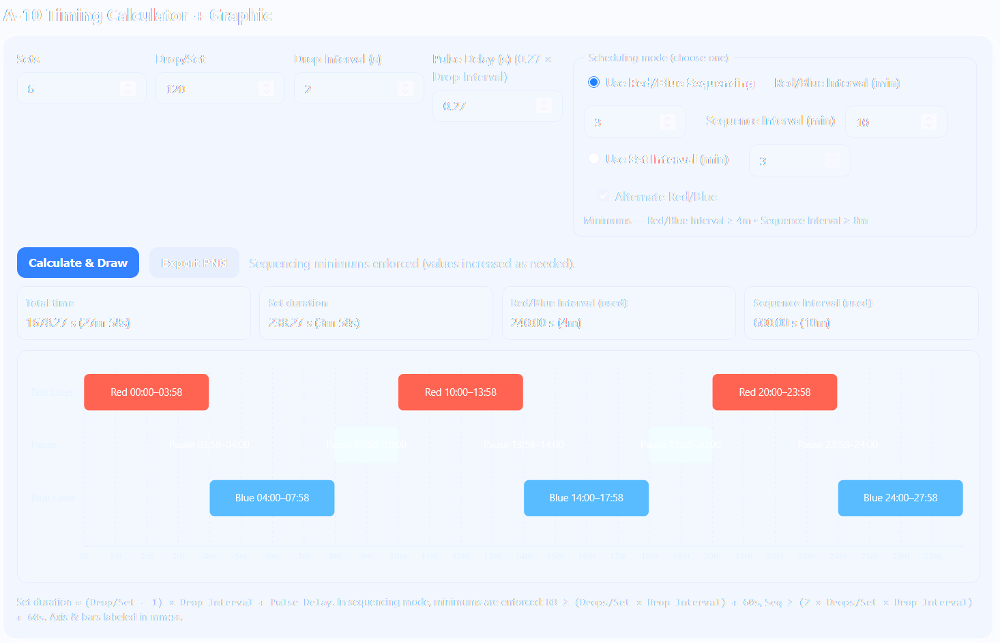

# A-10 Timing Calculator

A simple browser-based calculator and visualizer for **Micro-g LaCoste A-10 absolute gravimeter** measurement timings.

## Features

- **Input parameters**:
  - **Sets** — number of sets to acquire
  - **Drop/Set** — drops per set
  - **Drop Interval** (seconds)
  - **Pulse Delay** (defaults to `0.27 × Drop Interval`)
  - **Scheduling mode**:
    - **Red/Blue Sequencing** (default): requires  
      - **Red/Blue Interval (min)** — time from Red start → Blue start  
      - **Sequence Interval (min)** — time from Red start → next Red start  
      - Enforces minimums:  
        - `RB ≥ (Drops/Set × Drop Interval) + 60s`  
        - `Seq ≥ (2 × Drops/Set × Drop Interval) + 60s`
    - **Set Interval**: simple start-to-start spacing, with optional alternating Red/Blue sets

- **Outputs**:
  - Total measurement time (seconds + human readable)
  - Set duration
  - Effective Red/Blue or Set intervals
  - Mode notes (whether sequencing minimums were enforced)

- **3-lane Gantt diagram**:
  - Red Laser
  - Pause
  - Blue Laser  
  All bars are labeled with their start/end times (`mm:ss`).

- **Export PNG** — download the timeline as an image.

## Usage

1. Open [`A10_timing_simple.html`](A10_timing_simple.html) in any modern browser (Chrome, Firefox, Edge).
2. Adjust input fields at the top.
3. Click **Calculate & Draw** to recompute.
4. Review numeric results and timeline graphic.
5. Use **Export PNG** to save a copy of the graphic.

Produces:  
- **Total time**: ~23 hours 33 minutes  
- **Set duration**: ~4 minutes  

Timeline shows alternating Red/Blue sets with pauses.

---

### Notes

- HTML/JS is self-contained; no external dependencies.
- Works entirely offline.
- Axis ticks labeled in `mm:ss`, numeric results also shown in human-readable format (days/hours/minutes).
